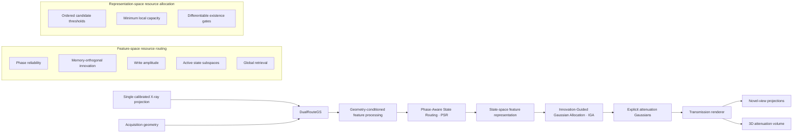

<div align="center">

# DualRouteGS

### Coordinated State and Gaussian Routing for Single-View Transmissive Reconstruction

**Single calibrated X-ray projection → explicit 3D Gaussian attenuation field**


</div>

---

## Overview

**DualRouteGS** is a research implementation for **single-view transmissive reconstruction**. Given one calibrated scalar X-ray transmission projection and its acquisition geometry, the model reconstructs an explicit three-dimensional Gaussian attenuation field in global coordinates. The recovered representation supports both **novel-view transmission rendering** and **volumetric reconstruction**.

The implementation is organized around two complementary mechanisms:

- **Phase-Aware State Routing (PSR)** — adapts feature-space state computation through phase reliability, memory-orthogonal innovation, write-amplitude control, active-subspace selection, and global retrieval.
- **Innovation-Guided Gaussian Allocation (IGA)** — adapts explicit representation capacity through ordered candidate thresholds, minimum-capacity constraints, and differentiable Gaussian-existence gates.

The repository provides the complete training, inference, rendering, evaluation, ablation, and statistical-analysis interfaces used by the project.

---

## Method at a Glance



### Design principle

DualRouteGS separates **where computation should be spent** from **where explicit Gaussian capacity should be allocated**. PSR operates in the learned state space, while IGA controls the density of the final explicit representation. This separation keeps the implementation modular and makes the two resource-allocation mechanisms independently testable through ablations.

---

## Core Components

| Module | Role | Entry point |
| --- | --- | --- |
| **DualRoute backbone** | Geometry encoding, AdaLN, and 2D RoPE | `dualroutegs/models/dualroute.py` |
| **PSR** | Phase reliability, memory-orthogonal innovation, amplitude/subspace/query selection | `dualroutegs/models/psr.py` |
| **Sparse scan** | Order-preserving sparse scanning and associative training scan | `dualroutegs/models/scan.py` |
| **IGA** | Ordered candidate thresholds, minimum capacity, differentiable existence gates | `dualroutegs/models/iga.py` |
| **Gaussian representation** | Attenuation Gaussian parameters and covariance construction | `dualroutegs/gaussians.py` |
| **Transmission rendering** | CUDA backend and analytic PyTorch reference implementation | `dualroutegs/rendering/` |
| **Diffusion** | Forward diffusion and DDIM driven by rendered predictions | `dualroutegs/diffusion.py` |
| **Data** | Data loading and patient/scene split checks | `dualroutegs/data/dataset.py` |
| **Execution** | Training, inference, and evaluation | `train.py`, `infer.py`, `evaluate.py` |

Data conventions are documented in [`docs/DATA.md`](docs/DATA.md).

---

## Installation

Python **3.10+** is required. The reference validation environment used Python 3.12 and PyTorch 2.5.1 on CPU.

### 1. Create an isolated environment

```bash
python -m venv .venv
source .venv/bin/activate
python -m pip install --upgrade pip
```

### 2. Install PyTorch and DualRouteGS

For CPU-side validation:

```bash
python -m pip install torch==2.5.1 --index-url https://download.pytorch.org/whl/cpu
python -m pip install -e .
```

For GPU training, install a CUDA-enabled PyTorch build and a compatible CUDA toolkit with `nvcc`, then compile the bundled rendering backend:

```bash
python -m pip install ninja
python scripts/install_backend.py
python -m unittest discover -s tests -v
```

The CUDA installation uses `--no-build-isolation` so that the active PyTorch installation is visible during compilation. No additional model weights are required. The repository includes the required C++/CUDA source files and GLM headers under `third_party/ray_gaussian`.

---

## Quick Start

A minimal end-to-end smoke test can be executed entirely from the project root:

```bash
python -m unittest discover -s tests -v
python scripts/make_demo.py --output data/demo
python train.py --config configs/smoke.yaml --device cpu --output runs/smoke
python infer.py --checkpoint runs/smoke/last.pt \
  --input data/demo/example_input.npy \
  --camera data/demo/example_camera.json \
  --device cpu --volume-resolution 16 --output outputs/demo
```

> **Important:** the smoke configuration performs only three optimizer updates. The generated synthetic examples are intended solely to verify execution and **must not be interpreted as manuscript experiments or reconstruction-quality evidence**.

### Inference outputs

| File | Description |
| --- | --- |
| `gaussians.npz` | Hard-selected `means / scales / rotations / kappa` |
| `canonical_projection.npy` | Projection at the canonical virtual target view, restored to the input scale |
| `condition_projection.npy` | Reprojection under the measured input-camera geometry |
| `volume.npy` | Reconstructed attenuation field at the requested resolution, using xyz array axes |
| `metadata.json` | Coordinate scale, random seed, sampling steps, and measured routing statistics |

---

## Training on Calibrated Data

Prepare a manifest following [`docs/DATA.md`](docs/DATA.md). Existing scanner directories can be converted with:

```bash
python scripts/convert_scanner.py \
  --catalog data/catalog.json \
  --output data/calibrated
```

Train the full configuration with:

```bash
python train.py --config configs/paper.yaml \
  --manifest data/calibrated/manifest.json \
  --device cuda \
  --output runs/full
```

### Reference configuration

`configs/paper.yaml` retains the manuscript-explicit settings implemented in this repository:

| Setting | Value |
| --- | ---: |
| Network layers | 8 |
| Hidden width | 512 |
| Retrieval heads | 8 |
| State subspaces | 8 |
| Base subspaces | 2 |
| Anchor grid | 512 × 512 |
| Maximum Gaussians per anchor | 4 |
| Optimizer updates | 80K |
| Gradient accumulation | 4 steps |

Loss weights follow the stated configuration. Implementation details that are not specified by the manuscript are exposed as explicit configuration choices rather than being hidden in code.

> **Reproducibility note:** the name `paper.yaml` indicates the manuscript-oriented configuration, but does **not** by itself imply exact reproduction of every reported parameter count or performance value.

For smaller-scale debugging, use `configs/development.yaml`. The reference renderer scales with the number of rays multiplied by the number of Gaussians; therefore, the **CUDA backend is recommended for the 512 × 512 anchor configuration**. The CUDA adapter currently supports centered cone-beam cameras, while the analytic reference backend can additionally be used for parallel-beam and offset-detector checks.

### Resume training

```bash
python train.py \
  --resume runs/full/last.pt \
  --device cuda \
  --output runs/full
```

Training logs are written to `train.jsonl`. Checkpoints store the network, optimizer, instantiated configuration, iteration count, and major RNG states. Because the data iterator is recreated when training resumes, resumed training is not guaranteed to be sample-by-sample bitwise identical to an uninterrupted run.

Model selection should be performed on the validation split. The training script does not automatically inspect the test set.

---

## Single-View Inference

DualRouteGS accepts **exactly one measured transmission projection** together with its camera geometry:

```bash
python infer.py \
  --checkpoint runs/full/last.pt \
  --input data/input_projection.npy \
  --camera data/input_camera.json \
  --device cuda \
  --volume-resolution 256 \
  --output outputs/case001
```

The canonical target canvas is initialized from noise; the inference interface does not accept additional measured target images.

---

## Novel-View Transmission Rendering

The reconstructed Gaussian field can be rendered from new acquisition geometries:

```bash
python scripts/render_views.py \
  --gaussians outputs/case001/gaussians.npz \
  --geometry data/novel_geometry.json \
  --size 256 \
  --backend cuda \
  --device cuda \
  --output outputs/case001/novel_views.npz
```

This decouples reconstruction from downstream projection synthesis: the network predicts an explicit 3D attenuation representation, and the renderer evaluates that representation under a requested geometry.

---

## Evaluation Protocol

Install the optional metric dependencies:

```bash
python -m pip install -e '.[metrics]'
```

Evaluate the validation split first:

```bash
python evaluate.py \
  --checkpoint runs/full/last.pt \
  --split val \
  --volume \
  --device cuda
```

Run the test split only after fixing the model and hyperparameters:

```bash
python evaluate.py \
  --checkpoint runs/full/last.pt \
  --split test \
  --volume \
  --device cuda
```

### Metrics

**Projection domain**
- PSNR
- SSIM
- RMSE
- LPIPS via `--lpips` (optional)

**Volume domain**
- PSNR
- 3D SSIM
- RMSE

**Region / structure analysis**
- Region PSNR and MAE
- Dice
- Boundary-voxel NSD
- clDice

Results are aggregated over target views, scenes, and independent patients/objects, with group-level bootstrap confidence intervals. Paired statistical testing is available through:

```bash
python scripts/paired_statistics.py
```

The provided procedure uses paired Wilcoxon tests with Holm correction. Region-based evaluation is available through:

```bash
python scripts/evaluate_regions.py
```

Segmentation masks are supplied by an external, fixed evaluation workflow and are **not** used as reconstruction inputs.

---

## Ablation Studies

Ablation configurations are provided under `configs/ablations/` and include:

- static attention;
- static state routing;
- PSR only;
- static state routing with IGA;
- phase routing disabled;
- amplitude routing disabled;
- state-subspace routing disabled;
- query routing disabled.

Each ablation should be trained independently and evaluated under the same data split and evaluation protocol:

```bash
python train.py --config configs/ablations/<variant>.yaml ...
python evaluate.py --checkpoint <variant_checkpoint> --split val --volume --device cuda
```

This design isolates the contribution of the state-routing and Gaussian-allocation mechanisms without changing the external training/evaluation interface.

---

## Reproducibility and Scope

This repository is intended as a **transparent research implementation**, not as a claim that every manuscript number can be reproduced solely by running the default configuration.

The implementation explicitly distinguishes between:

1. **settings stated by the manuscript**, which are retained in the corresponding configuration;
2. **engineering choices required for execution**, which are exposed in configuration files;
3. **smoke-test settings**, which verify software correctness only;
4. **validation/test evaluation**, which should remain separated during model development.

For large anchor counts and high-resolution rendering, the CUDA backend is the intended execution path. The analytic PyTorch renderer remains useful as a reference implementation and for geometry checks.

---

## Source Attribution

Dependency sources, pinned revisions, modification scopes, and original licenses are documented in [`THIRD_PARTY_NOTICES.md`](THIRD_PARTY_NOTICES.md) and `third_party/licenses/`.

The main DualRouteGS project is organized independently, while third-party copyright notices and required attribution are retained.

---

<div align="center">

**DualRouteGS · Single-View Transmissive Reconstruction with Coordinated State and Gaussian Routing**

</div>
